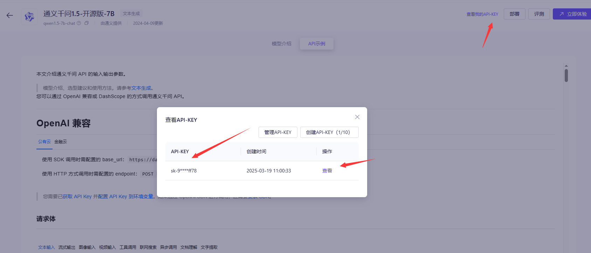

# What is PPT

AI-generated PowerPoint presentations are created using artificial intelligence to automatically generate slide content, layouts, and visuals based on a given topic. These AI tools analyze the input, structure key points, and format slides in a professional and visually appealing way.

# Requirements
Python 3.8.10 +

# Help message
```
$ python chatppt.py --help
usage: chatppt.py [-h] -t TOPIC -k API_KEY [-p PAGES] [-l {cn,en}]

I am your PPT assistant, I can help to you generate PPT.

optional arguments:
  -h, --help            show this help message and exit
  -t TOPIC, --topic TOPIC
                        Your topic name
  -k API_KEY, --api_key API_KEY
                        Your api key file path
  -p PAGES, --pages PAGES
                        How many slides to generate
  -l {cn,en}, --language {cn,en}
                        Output language
```

# How to use it

2. Install requirements
    ```
    $ pip install -r requirements
    ```
    
    ```
    pip install -i https://pypi.tuna.tsinghua.edu.cn/simple openai
    pip install python-pptx -i https://pypi.tuna.tsinghua.edu.cn/simple
    ```
    
2. Generate your PPT

    ```
    python QwenPPT.py -t "learn python" -k kEY -p 5 -l en
    ```

3. Generaten key



https://bailian.console.aliyun.com/#/model-market/detail/qwen1.5-7b-chat?tabKey=sdk


# Other

gamma.app

aippt.cn